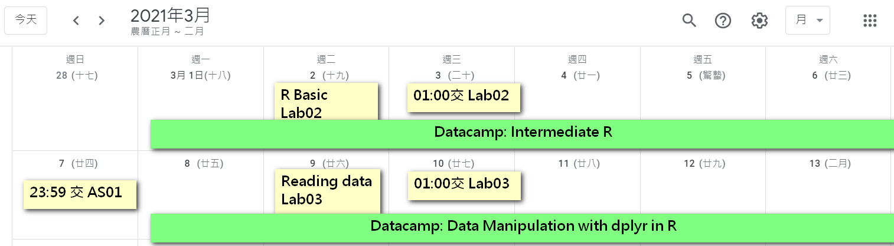

<style type="text/css">

.remark-slide-content {
    padding: 1em 1em 1em 1em;
    font-size: 28px;
}

.my-one-page-font {
  padding: 1em 1em 1em 1em;
  font-size: 20px;
  /*xaringan::inf_mr()*/
}

</style>

```{r message=FALSE,warning=FALSE,echo=FALSE}

```

# 自我介紹

<ul>
<li>personal background
    <ul>
    <li>企管系畢業</li>
    <li>台大新聞所碩一</li>
    </ul>
<li>R experience
    <ul>
    <li>新聞資料分析(108-2, 吉隆), 資料科學程式設計(共教)</li>
    <li>商管統計資料分析, 行銷數據分析, 貝氏統計(企管)</li>
    <li>空間分析(地理), 社群網絡分析(政治)</li>
    </ul>
<li>Teaching experience
    <ul>
    <li>108-1 資料科學與社會研究, 資料新聞工作坊</li>
    <li>109 winter text mining 帶大一學生</li>
    </ul>
<li>Interest
    <ul>
    <li>資料分析領域</li>
    <li>資料新聞領域</li>
    </ul>
</ul>

---

# R & RStudio

- R 是開源(open-source)且免費的軟體
- 擅長統計分析、視覺化，也可以用來做機器學習(machine learning)、文字探勘(text mining)等功能
- RStudio 是一個方便使用者寫程式的整合開發環境（Integrated Development Environment，簡稱為 IDE）
- 你不一定要用 RStudio 寫程式，但它非常方便，有各種增進寫程式效率的功能，最好還是用一下

---

# What can R do?

- R 可以產生可重複性的報告(reproducible research)，很適合交作業或是學術研究人員
- 輸出格式多樣，可以輸出成 word, PDF, html, etc.
- 也可以在裡面寫數學公式

```{r, echo=FALSE}
knitr::include_graphics('photo/Lab01_rpdf.jpg')
```

---

# What can R do?

- R 可以產生網頁，也可以架設部落格

```{r, echo=FALSE}
   knitr::include_graphics('photo/Lab01_rwebsite.jpg')
```

---

# What can R do?

- R 可以[出版書](https://bookdown.org/speegled/foundations-of-statistics/)

```{r, echo=FALSE}
   knitr::include_graphics('photo/Lab01_rbook.jpg')
```

---

# What can R do?

- R 可以架設[動態網頁/APP](https://gpilgrim.shinyapps.io/SwimmingProject-Click/)

```{r, echo=FALSE}
knitr::include_graphics('photo/Lab01_rshiny.jpg')
```

---

# Who uses R?

- 媒體業常常使用 R，不唬爛
- 經濟學人

```{r out.width='90%', out.height='90%',echo=FALSE}
knitr::include_graphics("photo/Lab01_economist.jpg")
```

---

# Who uses R?

- 媒體業常常使用 R，不唬爛
- BBC

```{r out.width='90%', out.height='90%',echo=FALSE}
knitr::include_graphics("photo/Lab01_BBC.jpg")
```

---

# Who uses R?

- 台灣的案例
- readr

```{r out.width='90%', out.height='90%',echo=FALSE}
knitr::include_graphics("photo/Lab01_readr.jpg")
```
---

# Who uses R?

- 台灣的案例
- 前天下雜誌、海峽時報資料記者林佳賢

```{r out.width='90%', out.height='90%',echo=FALSE}
knitr::include_graphics("photo/Lab01_dataman.jpg")
```

---

# You can ... after taking this course

- 獲取資料: 從不同來源獲取數據，包含 open data, API, 自己寫爬蟲, 
- 讀取資料: 在 R 中讀進各類型的資料，包含 csv, xlsx, JSON, .shp 等
- 清理資料: 格式轉換, 寫條件判斷, 中英文處理, missing value
- 資料變換: 探索, 摘要, 欄位增減, 分組, 長寬表格轉換
- 資料視覺化: 在 R 中繪製有意義且好看、好讀的圖表
- 文字探勘: 學習 tf-idf, LDA, word segmentation 等概念並使用

---

# 我負責的事情

- Lab
 - Tutorial: 複習老師授課, 補充額外知識, 用簡報上課
 - Homework: 簡單作業活用 lab 所學, 用 html 繳交
 - 盡量使用 real, local, daily 的資料貼近實務
 - 除第一周外，課堂隔天(也就是週三)**凌晨 01:00** 前交
 - 不會每週都有，選高分計分，共10次
 - 你不想來上課習慣自學，只要交得出來也OK，但不要抄襲
- Assigment
 - 題目大約三到五題，以老師上課與回家看的內容(datacamp/老師影片/slide)為出題方向
 - 同樣盡量使用 real, local, daily 的資料貼近實務
 - 第二週開始有作業，**當週週日**前 23:59 前交
 - 不會每週都有，共有8次

---
# 進度規劃

- [Class Schedule](https://docs.google.com/document/d/1yCS14QwVC_S_bX81oxiqtVWQaswWIIksqqOxXgMNNiM/edit#heading=h.e2ga5h6c7m4l)
- In-class 代表課堂授課內容，當週課堂通常是在講前一週的At-home
- At-home 代表回家自行閱讀內容，做完作業就可以開始準備下一週的了

```{r, echo=FALSE}

```

---
# 一些不錯的資源 

- Meetup
 - [R-Ladies Taipei](https://www.facebook.com/groups/RLadiesTaipei/permalink/2305950439482020)
 - [Taiwan R User Group](https://www.meetup.com/Taiwan-R/)
- Facebook Group
 - [台灣R軟體Club](https://www.facebook.com/groups/1210634969026548)
 - [大數俱樂部](https://www.facebook.com/groups/242102892820317)
- Asking Questions
 - [stackoverflow](https://stackoverflow.com/)
 - [PTT R_Language](https://www.ptt.cc/bbs/R_Language/index.html)
- Other
 - [Bookdown](https://bookdown.org/)
 - [Rweekly](https://rweekly.org/)

---

class: inverse, center, middle

# Enjoy Learing 

希望 R 能變成你的第二外語！


